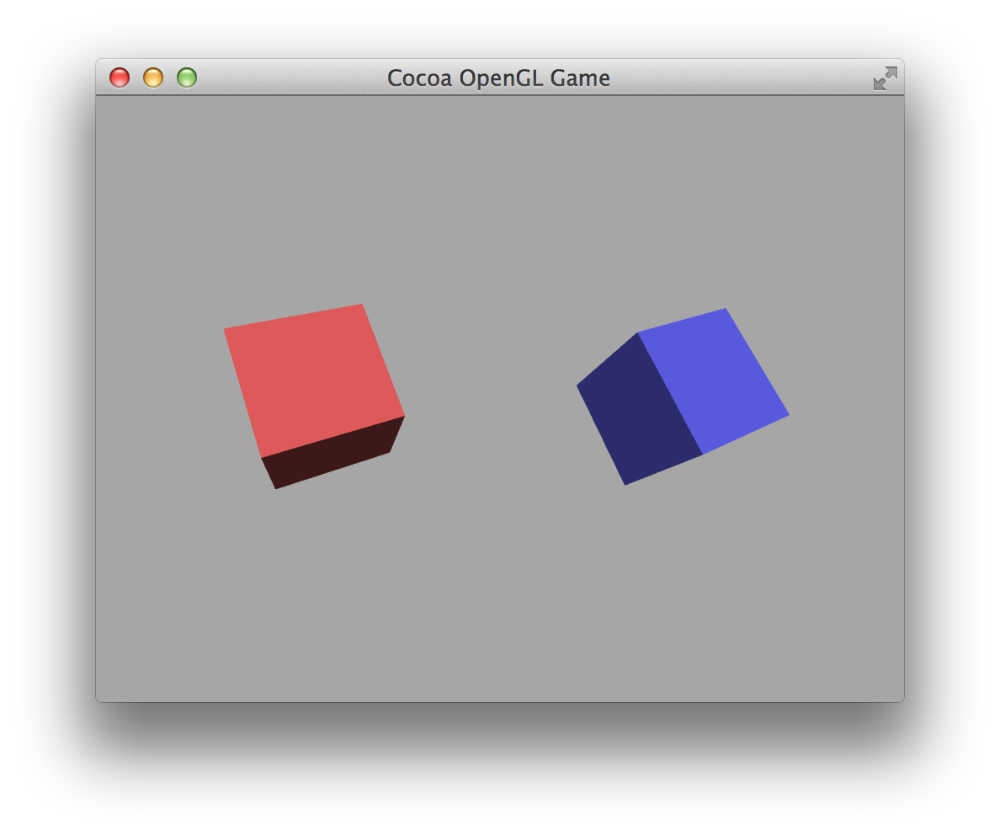

#Cocoa OpenGL Template

A template for Xcode for creating a Cocoa OpenGL game.

Unlike for iOS, Apple doesn't have a template for creating a simple OSX game with OpenGL. I've therefore created this template along with classes similar to `GLKView` and `GLKViewController`. I've also included a wrapper for OpenGL programs/shaders. This is based off of the default GLKit template on iOS, with two rotating cubes, however there are some differences:

* Targets OpenGL 3.2 Core Profile
* Only uses OpenGL shaders (GLSL v1.4) - no GLKit effects
* Allows the window to be resized or be fullscreen (**N.B.:** there is some code and instructions in the AppDelegate that you can uncomment to create a *fullscreen only* window)
* Rather than being animated the balls rotate as the mouse is moved across the view - there is some code in `PTGLView` and `PTGLViewController` that configure the tracking area
* 60fps with 4x anti-aliasing by default
* Cube data is in a separate header file

The rendering is, however, identical:

##Installation

* Download (ZIP or `git clone`) this repository
* Copy `Cocoa OpenGL Game.xctemplate` into `~/Library/Developer/Xcode/Templates` (you may need to create this directory)
* The template is added to a new 'Templates' group when you create your project

##Todo

* Custom icon